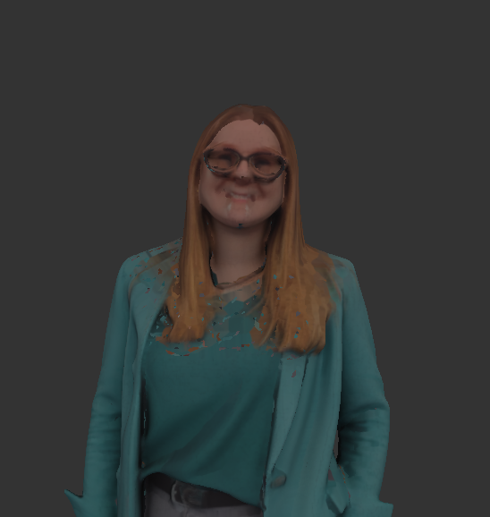
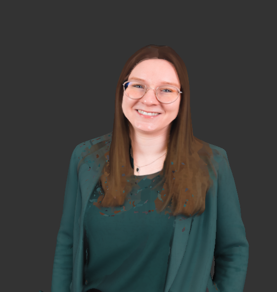

# face-decal-3d

A small browser tool that projects a 2D face photo onto a 3D head scan as a surface-conforming decal, then exports the combined result as a single GLB.

| Before — raw photogrammetry scan | After — clean photo decal projected on top |
| :---: | :---: |
|  |  |

Built with **Vite + TypeScript (strict)** and **Three.js** (`DecalGeometry`, `GLTFLoader`, `GLTFExporter`). Single page, no backend.

## Why

Photogrammetry head scans capture geometry well but textures around the face are often smeared, low-detail, or distorted by hair and glasses. This tool lets you take a clean 2D portrait, crop it down to just the face, and project it onto the scan as an overlay — recovering a usable likeness without re-baking textures or touching the underlying geometry.

## Workflow

1. **Load** a `.glb` / `.gltf` head scan.
2. **Upload and crop a face photo** (`.png` / `.jpg` / `.webp`). The crop modal supports a **rectangle** or **lasso** selection — hold **Shift** to add to the selection, **Alt** to subtract. **Ctrl+Z** undoes the last selection step (up to 10). Pixels outside the final selection become transparent. Inside the modal: **Ctrl+scroll** zooms toward the cursor, **Space+drag** pans, double-click resets the view. **Re-crop Image** in step 4 reopens the modal on the original upload so you can iterate without re-projecting.
3. **Ctrl + click on the model** to project the cropped image from the current camera angle as a `DecalGeometry` mesh. The Ctrl modifier prevents accidental placements while orbiting. **Ctrl+Z** restores the previous placement (history of 10).
4. **Adjust** with the size slider or **Shift + scroll** for live re-projection (Photoshop-brush style); two extra **Stretch X / Stretch Y** sliders scale the decal independently along the camera-aligned axes.
5. **Save** the combined model + decal as a single binary GLB.

## Viewport controls

A persistent help panel pinned to the top-right corner of the viewport summarizes all the bindings:

| Input | Action |
| ----- | ------ |
| **Ctrl + click** | place / re-project decal |
| **Ctrl + Z** | undo last decal position |
| **Shift + scroll** | resize decal (live) |
| **Drag** | orbit camera |
| **Right-drag** | pan camera |
| **Mouse wheel** | zoom camera |

## Quick start

```bash
npm install
npm run dev
```

Then open the URL Vite prints (typically `http://localhost:5173`).

### Other scripts

| Script              | What it does                                |
| ------------------- | ------------------------------------------- |
| `npm run dev`       | Start the Vite dev server                   |
| `npm run check`     | Type-check with `tsc --noEmit` (strict)     |
| `npm run build`     | Production build (`tsc -b && vite build`)   |
| `npm run preview`   | Preview the production build locally        |

## Usage notes

- **Front-facing assumption.** The decal is projected from the camera's current forward vector. The model's load-time orientation is treated as front-facing, so for best results have the face pointed roughly at the camera before you Ctrl+click.
- **Re-projecting.** If a placement looks bad — smeared across a side surface, partially missing — orbit to a better angle and Ctrl+click again, or hit **Redo Projection** to clear and re-pick. **Ctrl+Z** also walks back through the last 10 placements.
- **Sizing.** The size value is the edge length of the cube-shaped projection volume, in the model's world units. The default `0.15` works well for head models that are roughly a unit tall. Hold **Shift** and scroll over the viewport for live resizing, Photoshop-brush style.

## Architecture

```
src/
  main.ts        DOM event wiring + AppState orchestration
  scene.ts       Three.js scene, camera, OrbitControls, GLTF loading, camera fit
  cropper.ts     Modal crop overlay — rectangle/lasso shapes composed onto an alpha mask with replace / Shift-add / Alt-subtract ops
  decal.ts       placeDecalAtPointer / rebuildDecal / clearDecal — caches the placement so resize doesn't re-raycast
  exporter.ts    Wraps GLTFExporter; reparents model + decal under a temp group for clean export
  ui.ts          DOM helpers (status messages, step highlight, required-element lookup)
  types.ts       AppState, LoadedModel, DecalPlacement, PlacementSnapshot
  style.css      Dark studio aesthetic, JetBrains Mono
```

State lives on a single `AppState` object owned by `main.ts`. All consumers go through nullable checks (`model: LoadedModel | null`, `decalTexture: THREE.CanvasTexture | null`, …) so missing preconditions surface at compile time instead of as silent no-ops at runtime.

## Future ideas

Planned but not yet implemented:

- **Brightness & saturation sliders.** Color-correct the decal image after cropping. Either a CSS-style filter on a working canvas or a pixel-wise transform; result is rebaked into the `CanvasTexture` so the live decal updates.
- **Magic skin selection.** A one-click selection that captures skin *and everything inside the skin region* (eyes, mouth, teeth, etc.) — i.e. the head/face mask, with hair and clothing acting as the outer separator. Likely a face-segmentation model (MediaPipe / BodyPix style) producing an alpha mask combined with the existing add/subtract refinement.
- **Flat sticker mode (no surface conform).** A checkbox to opt out of `DecalGeometry` projection and instead place a flat textured plane on the model surface, anchored at the raycast hit point and oriented to face the camera. Useful when the surface is too irregular for the projection to look clean.
- **Press-and-rotate placement workflow.** Replace the click-to-place model with a press / drag / release gesture that lets you orient the decal in place before committing:
  - **Ctrl + mouse-down** raycasts onto the model and spawns a decal (projected, or a flat sticker if flat-sticker mode is enabled) facing the camera at the hit point.
  - **While the button is held**, dragging rotates the decal *in its own reference frame* — horizontal drag spins around the surface-normal-aligned Y axis, vertical drag tilts around the Z axis (nudging the decal forward/backward in its own frame).
  - **Holding R** while dragging swaps the active rotation to the third axis (in-plane 2D rotation around the projection normal), so all three axes are reachable from the same gesture.
  - **Releasing the button** commits the orientation; the decal stays where it is.
  - **Plain drag (no Ctrl) on an existing decal** re-enters the same rotation gesture against the already-placed decal — same R-toggle, same reference frame — so you can keep tweaking without re-projecting.
  - **Ctrl + click again** discards the current orientation and re-projects fresh from the new camera angle / hit point.

  See [`docs/press-rotate-workflow.md`](docs/press-rotate-workflow.md) for the implementation sketch.

Smaller cleanups (also `TODO`s in `src/decal.ts`):

- Multiple decals at once with selection / deletion.
- Bake the decal into the base UV texture and export as a single-material mesh.
- Rotation handle to spin the decal around the surface normal.
- **Alpha retouch brush.** Small brush tool to paint transparency directly onto the projected decal texture, so smeared edges or fringes can be erased without re-cropping the source image. Operates on the live `CanvasTexture` alpha channel; size and hardness sliders, undo stack.

## License

MIT
